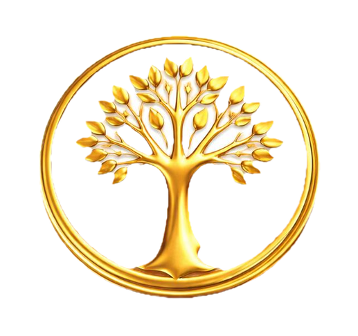

# Argyns — Family Registry

**Argyns** — это современный цифровой реестр 12 родов Аргын. Приложение создано для объединения потомков, сохранения истории и укрепления связи поколений. Наша цель — не разделять, а объединять.

---

## 🎯 Миссия и Цели
*   **Связь поколений**: Мы создаем мост между историческим наследием и цифровым будущим.
*   **Сохранение истории**: Оцифровка и систематизация данных о родах для будущих поколений.
*   **Единство**: Платформа для общения и взаимодействия представителей 12 родов.

## 🌟 Ключевые функции
*   📊 **Единая база данных**: Актуальная статистика общего количества зарегистрированных представителей племени Аргын.
*   🔢 **Счетчик рода**: Персонализированный визуальный контроль численности вашего конкретного рода.
*   🔔 **Уведомления и события**: Оперативная информация о новостях, съездах (асар) и культурных встречах в вашем городе.
*   📍 **Геолокация сообщества**: Простая регистрация с указанием города для поиска сородичей поблизости.
*   📱 **Premium UX/UI**: Темная тема, лаконичный дизайн и плавная навигация.

## 🛠 Технический стек
*   **Core**: Flutter (Dart) 3.38+
*   **Backend**: Firebase (Authentication, Cloud Firestore, Cloud Messaging)
*   **Design**: Vanilla CSS Aesthetics, Material 3 Customization.
*   **Platforms**: iOS (Apple Silicon native) & Android (NDK 28.x).

---

## 📄 Документация
*   [Инструкции по сборке (NDK Troubleshooting)](docs/TROUBLESHOOTING_NDK.md)
*   [Метаданные для Store (Listing)](docs/STORE_LISTING.md)
*   [Политика конфиденциальности](https://altenovduke-debug.github.io/ARGYN-app/docs/privacy_policy.html)

## 📞 Контакты
Если у вас есть вопросы или предложения:
*   Email: [support@argyns.com](mailto:support@argyns.com)

---

**Argyns — связь с родом, это шаг к сохранению наследия в цифровую эпоху.**

**Разработано Void Studio (voidstudio.lab)**
*A no-nonsense approach to software development.*
