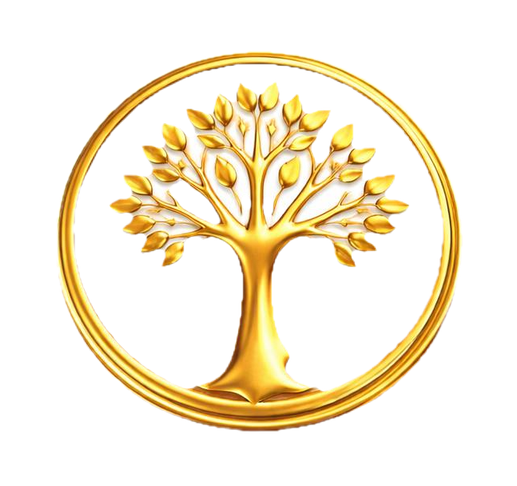

# Argyns — Family Registry

**Argyns** — это современный цифровой реестр 12 родов Аргын. Приложение создано для объединения потомков, сохранения истории и укрепления связи поколений. Наша цель — не разделять, а объединять.

---

## 📱 Скачать приложение
Вы можете скачать приложение Argyns по ссылкам ниже:

*   **iOS (App Store)**: [Скачать в App Store](https://apps.apple.com/us/app/argyns/id6759314097)
*   **Android (Google Play)**: Скоро в Google Play.

---

## 🌟 Ключевые функции
*   📊 **Единая база данных**: Актуальная статистика представителей племени.
*   🔢 **Счетчик рода**: Визуальный контроль численности вашего рода.
*   🔔 **Уведомления**: Важные новости и съезды сородичей.
*   📍 **Геолокация**: Регистрация с указанием города.

## 📄 Юридическая информация
*   [Политика конфиденциальности](https://altenovduke-debug.github.io/ARGYN-app/docs/privacy_policy.html)
*   [Поддержка (Support)](https://altenovduke-debug.github.io/ARGYN-app/docs/support.html)

## 📞 Контакты
По всем вопросам: [support@argyns.com](mailto:support@argyns.com)

---

**Argyns — связь с родом, это шаг к сохранению наследия в цифровую эпоху.**

**Разработано Void Studio (voidstudio.lab)**
*A no-nonsense approach to software development.*
